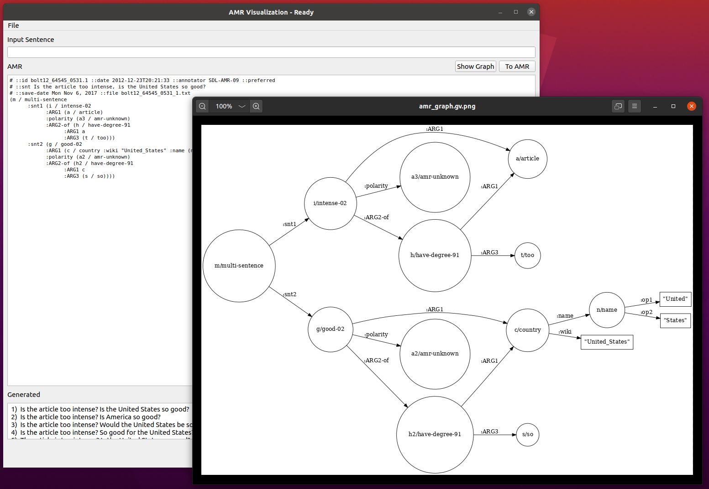

# AMR View
The GUI allows for simple viewing, conversion and plotting of AMR Graphs.


<!--- https://github.com/bjascob/amrlib/raw/master/docs/images/AMRView01.png --->


## Operation
For pip installations, the executable `amr_view` should be installed in the user's path.  This file
is simply a wrapper that calls `amrlib/amr_view/cli.py::main()`.  When running in-place from a GitHub
download the folder `scripts/50_Build_AMR_View` has the file `run_amr_view.py` which is setup to run the
version of amrlib two levels above it.  This is basically the same as `cli.py::main()` with the exception of
some path options.

Note that on startup loading models can take some time, during which the various buttons won't work.
The Window title at the top will tell you if the system is ready or loading.
In addition, log messages to the console outline the loading progress.

The `File` menu can be used to load and save AMR data.  Use `To AMR` to convert the `Input Sentence`
to an AMR graph.  Use `Show Graph` to display a plot of the graph with the default system viewer.
Be sure there is a valid graph in the main window to plot.  The `Generate` button converts the graph
to N (gtos_num_ret_seq below) different output sentences.

## Configuration options
The file `amrlib/amr_view/amr_view.json` holds the configuration parameters.
```
"stog_model_dir":       "amrlib/data/model_stog",
"stog_model_fn":        "model.pt",
"stog_device":          "cpu",
"gtos_model_dir":       "amrlib/data/model_gtos",
"gtos_num_ret_seq":     8,
"gtos_num_beams":       8,
"gtos_batch_size":      1,
"gtos_device":          "cpu"
```
`stog` options refer to the sequence-to-graph model (aka parsing)
while `gtos` options refer to the graph-to-sequence model (aka generation)

`gtos_num_ret_seq` sets the number of returned sentences that will be generated and printed

`gtos_num_beams` sets the number of beams for the beam search.  This needs to be >= `gtos_num_ret_seq`

The `x_device` params allow the model to run on the `cpu` or can be changed to `cuda:0` to run on the gpu.
Because we're only processing one graph or sentence at a time instead of a batch, there probably won't
be a noticeable difference between the two settings.
